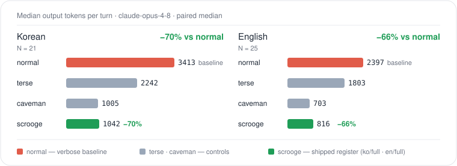

<p align="center">
  
</p>

<h1 align="center">scrooge</h1>

<p align="center">
  <code>토큰은 돈 — 구두쇠처럼 써라</code>
</p>

<p align="center">
  <a href="https://github.com/Kir93/scrooge-mode/stargazers"></a>
  <a href="https://github.com/Kir93/scrooge-mode/commits/main"></a>
  <a href="LICENSE"></a>
</p>

<p align="center">
  <a href="README.md">English</a> · 한국어
</p>

<p align="center">
  <a href="#데모">데모</a> ·
  <a href="#설치">설치</a> ·
  <a href="#표면">표면</a> ·
  <a href="#벤치마크">벤치마크</a> ·
  <a href="#메커니즘">메커니즘</a> ·
  <a href="#caveman과-비교">caveman 비교</a>
</p>

---

> AI 코딩 에이전트 응답의 출력 토큰을 줄이는 skill — 같은 답, 적은 토큰.

AI 코딩 에이전트용 한국어 1순위 이중언어(KO/EN) 출력 압축 skill — [Claude Code](https://docs.anthropic.com/en/docs/claude-code) full 지원, Codex는 hook+stats, Cursor·Windsurf·Cline·Continue·Gemini CLI는 skill-only([호스트 지원](#호스트-지원) 참고). 한국어 register는 한국어 문법 primitive(개조식 · 음슴체 · 존댓말 제거 · 반말 default) 기반 설계 — 영어 압축 규칙의 번역 **아님**.

**`~70% KO · ~73% EN · 출력만 압축 · 존대 제거`** — `claude-opus-4-8`, N=20–21 paired median.

<p align="center">
  <a href="#벤치마크"></a>
</p>

## 데모

같은 프롬프트, 같은 Claude 모델, 실제 벤치마크 출력. 프롬프트·응답 모두 한국어 — `ko/full` register의 의도된 데모. 영문 프롬프트 코퍼스는 [`benchmarks/prompts/en.txt`](./benchmarks/prompts/en.txt).

> Node.js로 만든 단일 모놀리스 서비스를 서비스 분리할 때 가장 먼저 봐야 할 측정 지표 3가지를 알려줘.

### Normal Claude (693 tokens)

```text
모놀리스 분리 전 측정 지표 3가지:

## 1. 모듈 간 결합도 (Coupling)
- 측정: import graph 분석 (`madge`, `dependency-cruiser`)
- 지표: cross-module import 수, 순환 의존 여부, fan-in/fan-out
- 판정: 결합 약한 경계가 분리 후보. 순환 의존 있으면 먼저 끊어야 함.

## 2. 도메인별 트래픽/리소스 사용량
- 측정: APM (Datadog/New Relic) 또는 endpoint별 로그 집계
- 지표: RPS, p95 latency, CPU/메모리 점유율 — 라우트/도메인 단위
- 판정: hot path와 cold path 분리하면 독립 스케일 이득.

## 3. 데이터 소유권 (DB 테이블 접근 패턴)
- 측정: 쿼리 로그 → 모듈×테이블 행렬
- 지표: 모듈별 read/write 테이블 집합, JOIN 경계, 트랜잭션 범위
- 판정: 한 모듈이 독점 쓰는 테이블 군 = 깨끗한 분리선.

---

**우선순위**: 3 → 1 → 2. 데이터 경계 못 그으면 서비스 쪼개도 분산 모놀리스.

**보조 지표**:
- 배포 빈도/장애 격리 — 조직 관점
- 팀 경계 (Conway's Law) — 소유권 명확화
- 빌드/테스트 시간 — 기준선
```

### Scrooge `ko/full` (188 tokens)

```text
1. **모듈 간 결합도** — import 그래프, 순환 의존, cross-module 호출 빈도. 분리 경계 후보 식별.
2. **트래픽/부하 편차** — endpoint별 RPS·CPU·메모리 점유율. 스케일 요구 다른 영역이 1순위 분리 대상.
3. **DB 접근 패턴** — 테이블별 read/write 소유권, join 경계, 트랜잭션 스팬. 공유 테이블 많으면 분리 비용 폭증.
```

같은 3개 지표, 같은 기술 판단 모양 — 이 프롬프트에서 **output token 약 73% 절감**.

> [!IMPORTANT]
> Output만 줄임. Reasoning · thinking · 정확성은 그대로. 구두쇠는 지출만 장부에 적지, 생각은 적지 않음.

## 설치

권장 quick-start:

```bash
npx -y github:Kir93/scrooge-mode
```

재현 가능한 설치를 위해 release 버전 핀(원하는 release tag로 교체):

```bash
npx -y github:Kir93/scrooge-mode#v0.6.1
```

**업데이트.** quick-start를 다시 실행하면 감지된 전 호스트가 그 자리에서 최신화됨 — Scrooge는 재실행 안전. Claude Code는 이제 skip 대신 marketplace를 새로고침하고 `claude plugin update` 실행(적용은 Claude 재시작); Codex·skill-only 호스트는 재실행 시 payload overwrite. latest 대신 특정 버전 핀은 위와 동일한 `--tag`/`#ref` 사용.

상세 setup, Claude Code plugin 설치, Codex `skills` 설치, troubleshooting, uninstall 절차는 [INSTALL.ko.md](INSTALL.ko.md). English install guide는 [INSTALL.md](INSTALL.md).

**활성화.** `/scrooge ko full` (또는 `/scrooge en lite` 등)로 register on. `/scrooge off`로 상태 해제. 전체 옵션은 `scrooge --help`. Claude Code hook에선 자연어도 동작 — "스크루지처럼 답해줘" / "talk like scrooge"로 활성화, "스크루지 꺼" / "stop scrooge"로 해제. 부정문("스크루지처럼 말하지 마" / "don't talk like scrooge")은 무시.

### 호스트 지원

installer가 감지된 호스트를 각 기능 tier로 설치함:

| Host | 설치 | Reinject hook | Stats | Statusline |
| ---- | ---- | :-----------: | :---: | :--------: |
| Claude Code | plugin | ✓ | ✓ | ✓ |
| Codex | skills + `config.toml` hook | ✓ | ✓ | — |
| Cursor · Windsurf · Cline · Continue · Gemini CLI | skills (skill-only) | — | — | — |

skill-only 호스트는 register 규칙을 skill로 받지만 활성화는 수동 — 턴마다 reinject hook 없음, 토큰 stats 없음. 완전한 hook+stats+statusline은 Claude Code, Codex는 `~/.codex/config.toml`로 hook+stats 제공.

## 표면

| 구성                     | 설명                                                                                      |
| ------------------------ | ----------------------------------------------------------------------------------------- |
| `/scrooge [lang] [dial]` | register 활성화. 2축 — `ko`/`en` × `lite`/`full`. 세션 단위 지속.                         |
| `/scrooge off`           | 상태 해제, 일반 prose 복귀.                                                               |
| 자연어 (hook)            | "스크루지처럼 답해줘" / "talk like scrooge"로 활성화, "스크루지 꺼" / "stop scrooge"로 해제. 부정문 무시, slash 우선. 언어는 구문 기준, dial `full`. |
| `UserPromptSubmit` hook  | 매 turn마다 register 재주입으로 dial drift 차단.                                          |
| Safety auto-clarity      | 보안 경고, 되돌릴 수 없는 동작 확인, 다단계 절차에서는 압축 해제. 양 언어 · 모든 dial.    |
| `registry.json`          | `언어 × dial → 규칙 파일 경로` 1:1 매핑. 언어 추가 = 규칙 파일 1개 + 레지스트리 항목 1줄. |
| `scrooge-stats` skill    | Claude/Codex에서 발견 가능한 stats 표면. hook 기반 session parser 실행, 모델 추정 금지. |
| 토큰 절감 statusline     | Claude Code 세션 JSONL의 실제 output 토큰 — tokenizer 추정 아님.                          |
| CLI 벤치마크 하네스      | 재현 가능한 runner (`benchmarks/run.py`) — [`benchmarks/`](./benchmarks/) 참조.           |

**왜 한국어가 중요한가.** 기존 출력 압축 skill 대부분은 영어 1순위거나 한문을 유일한 비영어 타깃으로 가정함. Scrooge는 한국어를 1순위 언어로 — register가 한국어 문법 primitive(개조식 · 음슴체 · 존댓말 제거 · 반말 default) 기반 설계됨, 영어의 번역 아님. 아키텍처는 i18n pluggable — 언어 추가는 규칙 파일 1개 + `registry.json` 항목 1줄, rule-engine 수술 없음.

## 벤치마크

**`claude-opus-4-8`** 측정. 전체 방법론·재현 명령은 [`benchmarks/`](./benchmarks/).

**측정 조건** (숫자 인용 전 반드시 읽을 것):

- **N=20–21 프롬프트 × 1회 실행, paired median.** 단일 실행 결과 · 분산 추정 없음(구독 timeout으로 몇 프롬프트 누락). 재실행 시 각 셀이 몇 퍼센트 흔들릴 수 있음. 헤드라인 퍼센트는 1 유효숫자 추정으로 취급(`~70%`이지 "69.5%"가 아님).
- **Register-clean run.** register hook 둘(scrooge 자체 활성화 hook·caveman)을 측정 동안 중립화해 `normal`/`terse` baseline에 주입 못 하게 함. 토큰은 `message.id` dedup(prose-only 기준). baseline이 호스트 scrooge hook에 몰래 압축된 이전 run은 폐기함.
- **Held-out cross-check.** 튜닝 corpus와 겹치지 않는 held-out 프롬프트셋(`prompts/{ko,en}-report.txt`)으로 재측정: KO ~71%, EN ~68%(각 N=11). 위 headline과 일치 → savings가 튜닝셋 overfit 아티팩트 아님.
- **Register-only isolation.** 하네스는 `claude --print --system-prompt <rule>`로 각 arm 실행 — Claude Code 기본 system prompt를 **대체**함. register 효과를 깔끔히 분리하지만, 실제 `/scrooge` 세션은 Claude Code 전체 system prompt 위에 register가 얹히므로 verbose 세션 대비 실측 절감은 헤드라인과 다를 수 있음. 전체 caveat는 [`benchmarks/README.md`](./benchmarks/README.md).
- **실측 `output_tokens` — tokenizer 추정 아님.** 숫자는 Claude Code 세션 JSONL의 `output_tokens` 필드 — API가 실제 청구한 값.

### 한국어

`normal`은 모델 기본 답변, `terse`는 "간결하게 답해"만 적용한 control, `scrooge:*`는 우리가 출하하는 규칙. `caveman:full`은 비교 baseline이며 Scrooge 모드 아님.

| Mode                  | 대표 output tokens (N=20) | normal 대비 절감 |
| --------------------- | ------------------------: | ---------------: |
| `normal`              |                      3186 |       (baseline) |
| `terse`               |                      2597 |             ~19% |
| **`scrooge:ko/full`** |                   **972** |         **~70%** |
| `caveman:full`        |                      1203 |             ~62% |

`scrooge:ko/full`은 한국어 출력을 verbose default 대비 **~70%**, `caveman:full` 대비 **~19%** 줄임(20개 중 15개 우세). `terse`보다도 짧음 → 단순 brevity 효과 아니라 register 효과.

### 영어

| Mode                  | 대표 output tokens (N=21) | normal 대비 절감 |
| --------------------- | ------------------------: | ---------------: |
| `normal`              |                      3578 |       (baseline) |
| `terse`               |                      2509 |             ~30% |
| **`scrooge:en/full`** |                   **969** |         **~73%** |
| `caveman:full`        |                      1264 |             ~65% |

`scrooge:en/full`은 영어 출력을 verbose default 대비 **~73%**, `caveman:full` 대비 **~23%** 줄임(21개 중 17개 우세) — 가장 강한 결과.

## 메커니즘

1. `/scrooge [lang] [dial]` 명령으로 모드 활성화. 토큰은 2개 독립 축으로 조합 — `/scrooge ko`, `/scrooge full`, `/scrooge ko lite` 등.
2. `UserPromptSubmit` hook이 명령 파싱 → 상태 파일에 `{lang, dial}` 저장 → [`registry.json`](registry.json)으로 규칙 경로 해석 → `additionalContext`로 주입.
3. 이후 매 turn마다 경량 reminder 재주입으로 register drift 방지.
4. `/scrooge off`로 상태 삭제. 규칙 자체의 auto-clarity가 안전 컨텍스트(보안 경고, 되돌릴 수 없는 동작 확인, 다단계 절차)에서는 압축 해제 — 사용자가 opt-out할 필요 없음.

**언어 추가**:

1. `rules/{lang}/{lite,full}.md` 규칙 파일 작성.
2. [`registry.json`](registry.json)에 항목 1개 추가:

   ```json
   {
     "ja": { "lite": "rules/ja/lite.md", "full": "rules/ja/full.md" }
   }
   ```

3. 5건 sample 출력을 QA checklist ([CONTRIBUTING.md](CONTRIBUTING.md)) 기준 self-check → PR.

## caveman과 비교

[caveman](https://github.com/JuliusBrussee/caveman)은 영감을 준 프로젝트. Scrooge는 fork나 README/code 복붙이 아니라, caveman을 명시적 benchmark/reference로 두는 KO-first 독립 구현. **caveman alternative**(caveman 대안) — 또는 **Korean caveman**(한국어 caveman) — 을 찾아왔다면 바로 그 자리: 같은 token-miser 아이디어를 번역이 아니라 한국어 1순위로 재구축한 것.

| 축                | caveman                            | Scrooge                                                |
| ----------------- | ---------------------------------- | ------------------------------------------------------ |
| 1차 목표          | 공격적 영어 압축                   | Korean-native 이중언어 압축                            |
| 언어              | EN (+ wenyan 한문)                 | KO, EN; `registry.json` 기반 i18n                      |
| 한국어 register   | 없음                               | native — 개조식 · 음슴체 · 존댓말 제거 · 반말 default  |
| 이번 영어 결과    | `1264` median tokens               | 더 강한 압축 (`969` median tokens), 청정 run에서 ~23% 우세 |
| 여기서의 벤치마크 | 비교 arm (`caveman:full`)          | 실측 `output_tokens` runner, paired reports            |

요약: Scrooge는 caveman에 한국어만 덧댄 문서/구현으로 보이면 안 됨. 핵심은 한국어 1순위 register 설계이고, caveman은 출처와 가장 강한 영어 비교 baseline으로 명시함.

## 기여

개발 setup, parity 규칙, 언어 추가 절차, PR check, branch protection 지침은 [CONTRIBUTING.ko.md](CONTRIBUTING.ko.md). English contributing guide는 [CONTRIBUTING.md](CONTRIBUTING.md).

## 라이선스 / 출처

MIT © 2026 Kir93. 자세한 내용은 [LICENSE](LICENSE).

Inspired by [caveman](https://github.com/JuliusBrussee/caveman) (MIT, © Julius Brussee) — 컨셉만 차용, i18n-first로 독립 재구현(verbatim 복사 없음).
